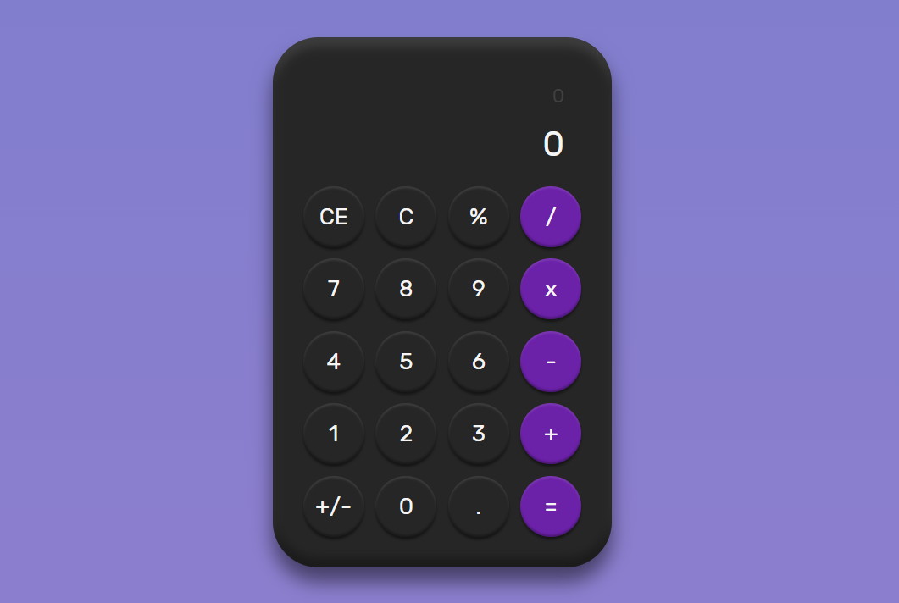

# Calculadora

Esta é uma calculadora simples desenvolvida utilizando as tecnologias React, TypeScript e Tailwind CSS. Ela permite realizar cálculos básicos, como adição, subtração, multiplicação, divisão, cálculo percentual, alteração de sinal do número e limpeza dos dados.

## Funcionalidades

A calculadora possui as seguintes funcionalidades:

- **Adição**: permite somar dois números.
- **Subtração**: permite subtrair um número de outro.
- **Multiplicação**: permite multiplicar dois números.
- **Divisão**: permite dividir um número por outro.
- **Cálculo Percentual**: permite calcular a porcentagem de um número em relação a outro.
- **Alteração de Sinal**: permite alterar o sinal de um número, tornando-o positivo ou negativo.
- **Limpar Dados**: permite limpar todos os dados inseridos na calculadora.

## Tecnologias Utilizadas

- **React**: uma biblioteca JavaScript de código aberto para criar interfaces de usuário.
- **React Vite**: um framework de desenvolvimento rápido para criação de aplicativos React modernos.
- **TypeScript**: um superset do JavaScript que adiciona tipagem estática opcional ao código.
- **Tailwind CSS**: um framework CSS utilitário de baixo nível que permite criar interfaces personalizadas com facilidade.

